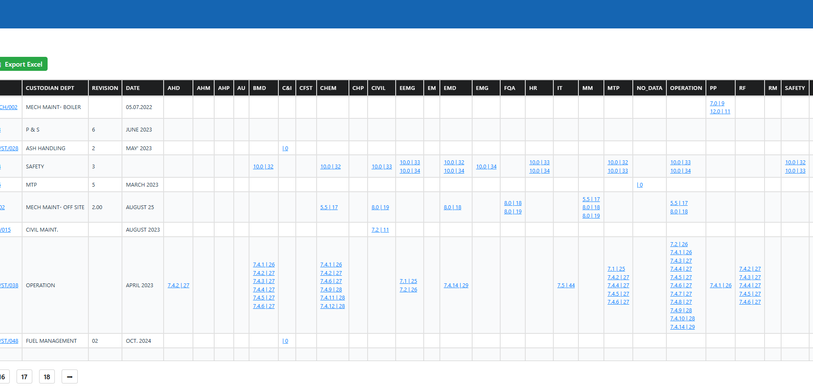
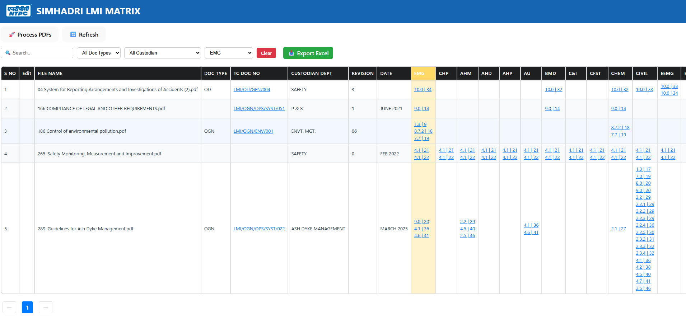

# 📄 LMI Matrix

### Location Management Instructions (LMI) Matrix Generator

**AI-Powered Document Intelligence System for Automated LMI Responsibility Matrix Generation**

<p align="center">


</p>

---

# 📖 Project Overview

The **Location Management Instructions (LMI) Matrix** is an AI-assisted document processing application designed to automate the extraction of operational instructions from Location Management Instruction (LMI) PDF documents.

The system analyzes both **paragraphs** and **tabular data**, identifies important operational information, assigns responsibilities based on predefined business rules, and generates a structured **Responsibility Matrix** for easy review and tracking.

The solution significantly reduces manual effort while improving consistency and accuracy in document analysis.

---

# 🎯 Objectives

* Automate extraction of information from LMI PDF documents.
* Eliminate manual data entry.
* Generate a structured Responsibility Matrix.
* Improve traceability of operational instructions.
* Store extracted information in Excel or SQL Server.
* Enable quick searching and reporting.

---

# ✨ Key Features

* 📄 PDF Text Extraction
* 📋 Table Extraction from PDFs
* 🤖 AI-Based Information Identification
* 🧠 Intelligent Responsibility Mapping
* 📊 Responsibility Matrix Generation
* 💾 Excel Export
* 🗄 SQL Server Storage
* 🔍 Searchable Records
* ⚡ Automated Processing Pipeline
* 📈 Improved Data Accuracy

---

# ⚙ Workflow

```text
LMI PDF Documents
        │
        ▼
PDF Processing
(Text + Tables)
        │
        ▼
Data Cleaning
        │
        ▼
AI / ML Processing
        │
        ▼
Instruction Extraction
        │
        ▼
Responsibility Assignment
        │
        ▼
LMI Matrix Generation
        │
        ▼
Excel / SQL Server
```

---

# 🛠 Technology Stack

| Technology               | Purpose                |
| ------------------------ | ---------------------- |
| Python                   | Core Development       |
| Machine Learning         | Information Extraction |
| PDF Processing Libraries | PDF Parsing            |
| Pandas                   | Data Processing        |
| SQL Server               | Database Storage       |
| Excel                    | Report Generation      |
| Regular Expressions      | Pattern Matching       |

---

# 📂 Project Structure

```text
LMI-Matrix
│
├── input_pdfs/
├── extracted_data/
├── models/
├── database/
├── output/
│   ├── responsibility_matrix.xlsx
│   └── reports/
├── scripts/
├── main.py
├── requirements.txt
└── README.md
```

---

# 🚀 Getting Started

Clone the repository

```bash
git clone https://github.com/yourusername/LMI-Matrix.git
```

Install dependencies

```bash
pip install -r requirements.txt
```

Run the application

```bash
python main.py
```

---

# 📊 Output

The system generates:

* Extracted Instructions
* Responsible Department
* Responsible Person/Role
* Location Information
* Instruction Categories
* Excel Responsibility Matrix
* SQL Database Records

---
# 🖥 Screenshots

## Dashboard


---

## Responsibility Matrix



---

## PDF View


---

## Departent Selection



# 💡 Challenges Solved

* Extracting text from complex PDF layouts.
* Reading both paragraphs and tables.
* Handling inconsistent document formats.
* Identifying responsibilities automatically.
* Structuring unorganized information.
* Reducing manual processing time.

---

# 👩‍💻 My Contributions

* Designed the complete document processing workflow.
* Developed PDF extraction modules.
* Implemented preprocessing and data cleaning.
* Built AI-assisted information extraction logic.
* Created responsibility mapping logic.
* Generated Excel-based Responsibility Matrix.
* Integrated SQL Server for persistent storage.
* Optimized extraction accuracy for mixed-format documents.

---

# 🔮 Future Enhancements

* OCR support for scanned PDFs.
* Named Entity Recognition (NER) using NLP.
* Large Language Model (LLM)-based instruction extraction.
* Web-based dashboard for document uploads.
* Automatic department recommendation.
* Batch processing of multiple PDF files.
* PDF comparison and version tracking.

---

# 📜 Disclaimer

This repository is a portfolio implementation. Any confidential organizational documents, proprietary rules, or sensitive operational information have been excluded or replaced with representative examples.

---

# 👤 Author

**Sudha**

Python Developer | AI/ML Enthusiast | Document Intelligence | Data Extraction | Automation

---

⭐ If you found this project interesting, consider giving it a star!
